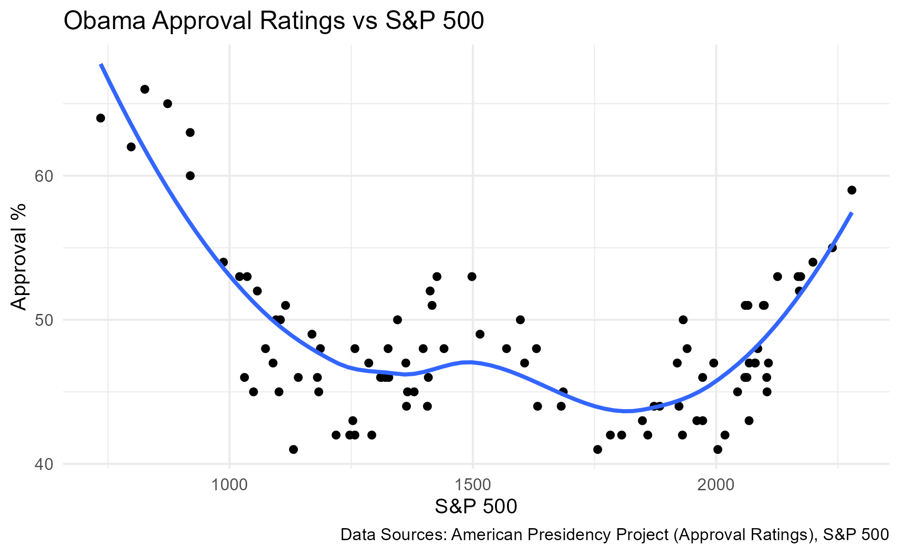

## Project thoughts

My research question for the Final Project is: How are the approval ratings of incumbent U.S. presidents running for the second term related to the stock market performance during their first term? My hypothesis is that higher stock market growth results in higher approval ratings going into a re-election. 
The hypothesis may be true as economic performance is a big talking point during elections and it makes sense that the voting public would be more receptive to the second term of a President that has shown economic growth. In this case, the variables of interest are the performance of the S&P 500 index, which is usually used to measure and gauge the development of the U.S. economy, and the approval ratings of an incumbent President going into re-election taken from the Roper Center. 
The approval rating variable will be measured by taking multiple sources (to ensure the overall representation is as accurate as possible) and will be compared to the S&P based on monthly changes in the index and approval ratings between the midterm and presidential elections (24 months). A pattern in the data that would prove my hypothesis is if positive and negative changes in the S&P translate to approval ratings and since the data will be measured over 2 years, it can account for before an incumbent declares that they are running again. 
A pattern that would disprove is if there was no positive correlation on average across the 24-month period.


The two graphs strongly suggest that there is no correlation between Presidential Approval Rating and the price of S&P 500, at least under the Obama administration. I felt the Obama administration was a good choice to see if there was a correlation as there was the 2009 Recession and the 2010 and 2014 midterms where the Republicans had gains in the Senate, House and gubernatorial elections. The graph that compares the net changes of the S&P and Approval ratings indicates there is no relationship between the variables. The secod graph is the best indicator of an absence of a relationship as in this graph we are comparing the net changes in the same month and there is still no clear relationship between variables. A way to improve on this study would be to take data from other Presidents in the past and compare. But it could be inferred that at least in the first half of 2010s there is no clear relationship between Presidential Approval ratings and the S&P 500.


```{r}
library(readr)
library(tidyverse)
library(dplyr)
library(ggplot2)

pres <- read_csv("data/Presidential_Approval_Data.csv")
SP <- read_csv("data/SP500.csv")


pres <- pres |> 
  mutate(Month = as.character(Month))

SP <- SP |>
  mutate(Date = as.character(Date))


SP <- rename(SP, Month = Date)


result <- inner_join(pres, SP, by = "Month")


plot <- ggplot(data = result, aes(x = Price, y = Approving)) +
  geom_point() + 
  geom_smooth(se = FALSE) + 
  labs(
    title = "Obama Approval Ratings vs S&P 500",
    x = "S&P 500",
    y = "Approval %",
    caption = "Data Sources: American Presidency Project (Approval Ratings), S&P 500"
  ) +
  theme_minimal() + 
  scale_color_discrete(name = "Year/Term")

plot


result <- result |>
  mutate(`Change %` = as.numeric(gsub("%", "", `Change %`)))


plot2 <- ggplot(data = result, aes(x = `Change %`, y = `Approval Change`)) +
  geom_point(size = 2, color = "black", alpha = 0.7) + 
  geom_smooth(method = "lm", se = FALSE, color = "blue", size = 1) +
  labs(
    title = "Approval Change vs. S&P 500 Change %",
    x = "S&P 500 Change (%)",
    y = "Approval Change",
    caption = "Data Sources: American Presidency Project (Approval Ratings), S&P 500"
  ) +
  theme_minimal(base_size = 14)


ggsave("approval_vs_sp500.png") 

```



